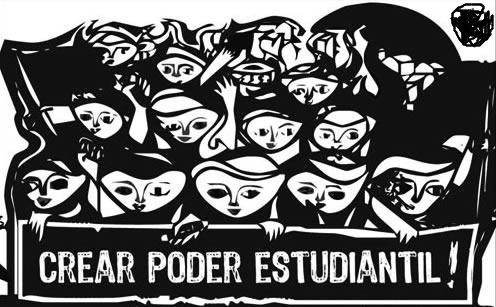

# Centro de estudiantes 

**_Mientras se realiza el 2° Foro de Centros de Estudiantes de Colegios Secundarios y a pocos días de las elecciones del centro de estudiantes en nuestra facultad, nos inspiramos en resolver un problema con prolog._**

### Primera parte
Sabemos los años que hay elecciones
~~~
%elecciones(año).
elecciones(2017).
elecciones(2019).
~~~

Tenemos un padrón de estudiantes regulares.
~~~
%estudiante(departamento, año, nombre).
estudiante(sistemas, 2019, juanPerez).
estudiante(sistemas, 2019, unter).
estudiante(sistemas, 2019, mathy).
estudiante(sistemas, 2017, unter).
estudiante(sistemas, 2017, mathy).
estudiante(sistemas, 2018, unter).
estudiante(quimica, 2018, cacho).
~~~

Y por supuesto tenemos la info de la cantidad de votos obtenida en cada elección
~~~
%votos(agrupacion, votos, año).
votos(franjaNaranja, 2500, 2017).
votos(franjaNaranja, 2152, 2019).
votos(agosto29, 710, 2019).
votos(seu, 917, 2019).
~~~

Se quiere averiguar

1. Quien ganó cada elección. 
2. Si es cierto que siempre gana el mismo.
3. Si hubo fraude en un año en particular, lo que ocurre si hay más votos registrados que electores en el padrón. 
4. Todos los años en que hubo fraude.
5. Comprobar si hay algun departamento que tenga más estudiantes que todos los demás departamentos sumados.

### Segunda parte
Nos llega información extraoficial sobre las acciones que realiza cada agrupación

~~~
realizoAccion(franjaNaranja, lucha(salarioDocente)).
realizoAccion(franjaNaranja, gestionIndividual(“Excepción de correlativas”, juanPerez, 2019)).
realizoAccion(franjaNaranja, obra(2019)).
realizoAccion(agosto29, lucha(salarioDocente)).
realizoAccion(agosto29, lucha(boletoEstudiantil)).
~~~

Realizar los predicados para encontrar a las agrupaciones que sean:
* Demagógica, es decir, si solo hizo gestiones individuales.
* Burócrata: si no participó en ninguna lucha.
* Transparente: si todas las acciones que realizó fueron genuinas.
    * Obra: es genuina si se hizo en un año en que no hubo elecciones.
    * Gestion individual: es genuina si la persona beneficiada era estudiante regular en el año en que se hizo.
    * Lucha: siempre es genuina.

### Tercera parte
* Elegir alguno de los predicados realizados que sea inversible y otro que no, y justificar la utilidad y alcances del concepto. 
* Mostrar ejemplos de consulta.
